# BMP Boost Extender Mini
BMP Boost Extender Mini は、せきごん氏によってデザインされたBMP Boostおよびその拡張ボードであるBMP Boost Extenderの小型版です。  
BMP Boostの追加IOポートからFFC接続用のピンを取り出します。

torabo-tsuki-lpのようなBMP Boostを搭載するキーボードに対し、追加のモジュールなどを接続することを想定し設計しています。

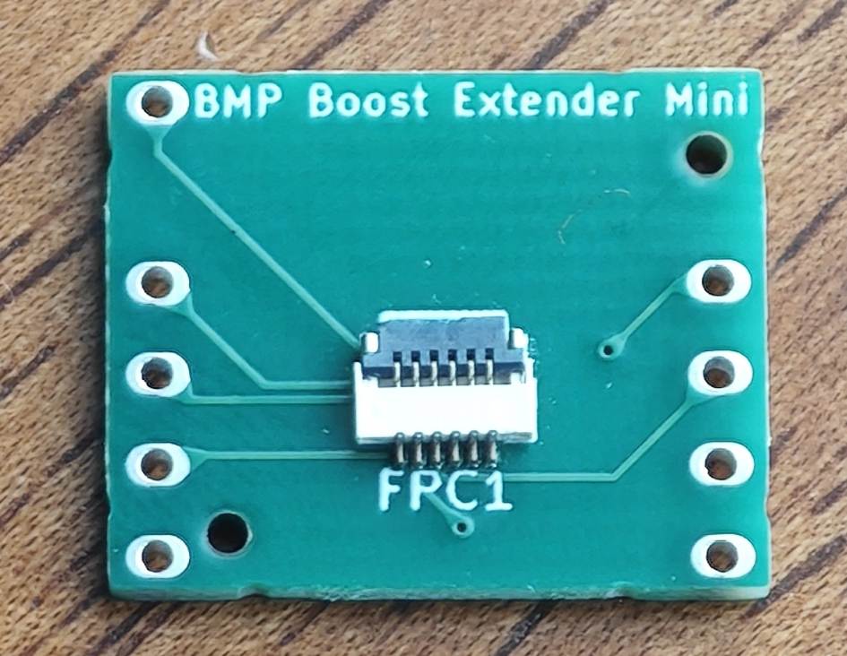 
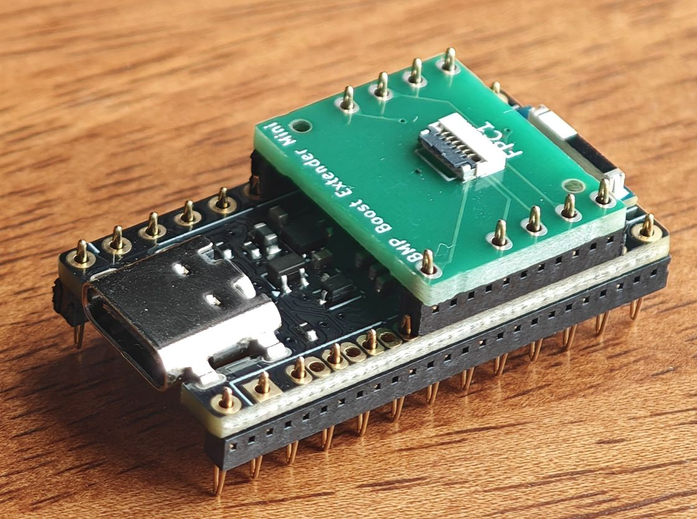 

### 関連リンク
- [BMP Boost](https://github.com/sekigon-gonnoc/BLE-Micro-Pro/tree/master/bmp-boost)
- [BMP Boost Extender](https://github.com/sekigon-gonnoc/BLE-Micro-Pro/tree/master/bmp-boost#bmp-boost%E7%94%A8%E6%8B%A1%E5%BC%B5%E3%83%9C%E3%83%BC%E3%83%89)
- [torabo-tsuki-lp](https://github.com/sekigon-gonnoc/torabo-tsuki-lp)

## 基板データについて
[pcb](./pcb)フォルダにKiCadのプロジェクトデータを格納しています。

- JLCPCB発注用のガーバーデータ、BOMファイル、CPLファイルは[pcb/jlcpcb/production_files](./pcb/jlcpcb/production_files/)にまとめています。

### 仕様
- 基板サイズ: 17.8mm x 14.5mm
- コネクタ: 6pin、0.5mmピッチ FFCコネクタ (torabo-tsuki-lp用と共通)

### 回路パターン
FFCへの回路設計は基本的にBMP Boost Extenderと同じです。GNDはBMP Boost追加IOポートのGNDピンへ接続されるように変更しています。
詳しくは以下の図や基板データを参照してください。

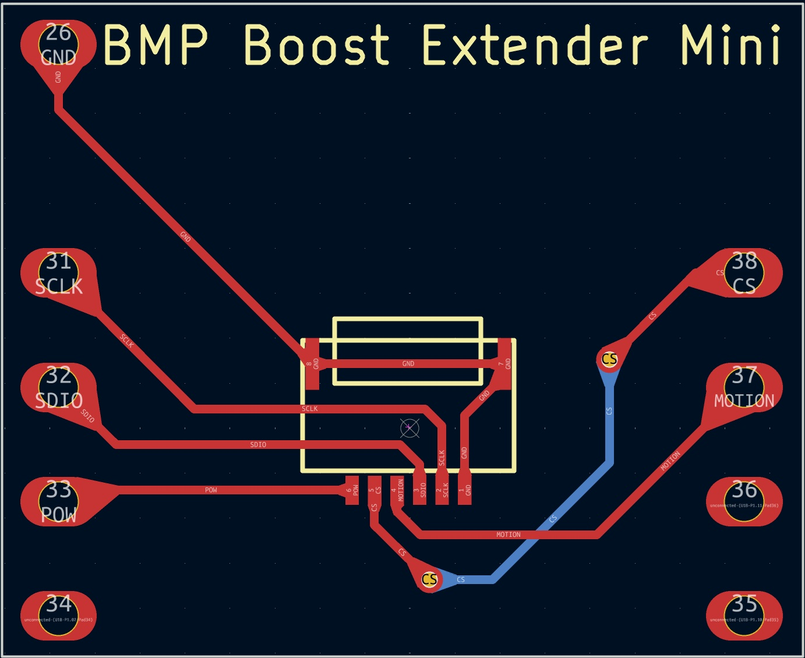 

## 接続方法
BMP Boost Extender Miniは、BMP Boostの追加IOポートに接続して使用します。
1. 12ピンコンスルーを2つに分割し、6ピンずつにします。
1. 図のように、不要なピンを外します。

    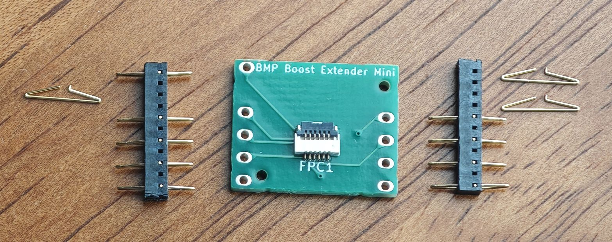 

1. BMP Boost Extender MiniをBMP Boostの追加IOポートに接続します。表、裏どちら側からでも接続可能です。
1. FFCを接続して、トラックボールやトラックパッドモジュールを接続します。

    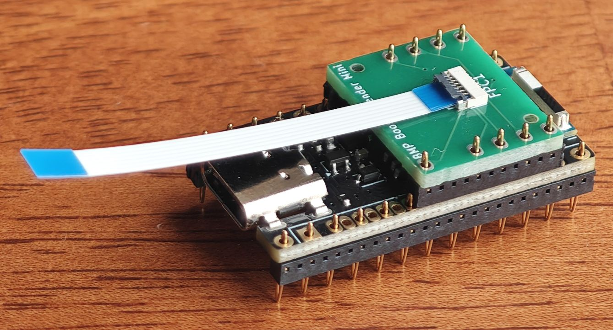 

動作確認済みのモジュールは以下です。

- トラックボールモジュール(マウスセンサーモジュール): https://github.com/sekigon-gonnoc/small-mouse-sensor-module
- トラックパッドモジュール： https://github.com/sekigon-gonnoc/iqs7211e-trackpad-module
- ロータリーエンコーダー(EC11, 12系)

## 注意事項
torabo-tsuki-lpに接続する場合、純正の電池カバーを使用するとBMP Boost Extender Mini を接続しているコンスルーとわずかに干渉してしまいます。モジュール搭載用電池カバー(下記)を利用するか、
該当箇所を薄肉化したカスタム電池カバー[Right](3d-models/torabo-tsuki-cover/torabo-tsuki-lp/STL/controller-cover-aa_thin-Right.stl), [Left](3d-models/torabo-tsuki-cover/torabo-tsuki-lp/STL/controller-cover-aa_thin-Left.stl)を使用することをお勧めします。

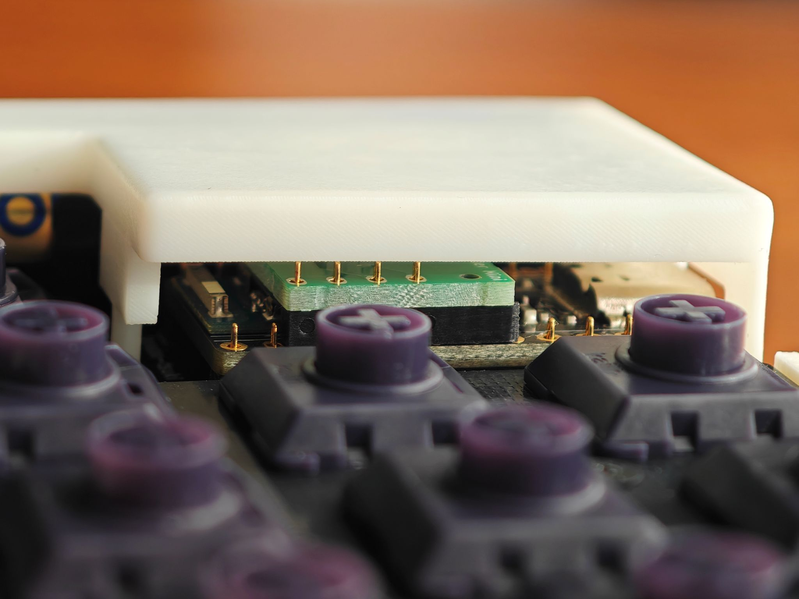 
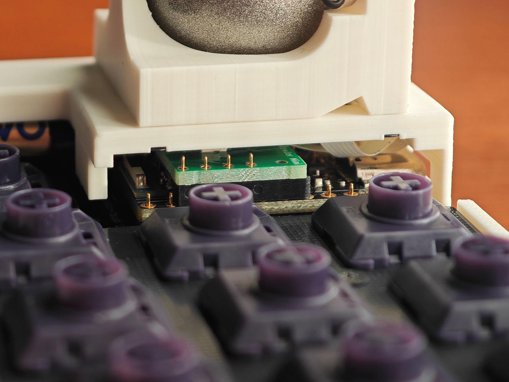 

## デバイスツリーの例
- [BMP Boost Extenderの例](https://github.com/sekigon-gonnoc/BLE-Micro-Pro/tree/master/bmp-boost#%E3%83%87%E3%83%90%E3%82%A4%E3%82%B9%E3%83%84%E3%83%AA%E3%83%BC%E3%81%AE%E4%BE%8B)を参考にしてください。

- 以下はtorabo-tsuki-lp に接続した場合のデバイスツリーの例です。前提として、central側のメイン基板にトラックボールモジュールを接続し、BMP Boost Extender Miniでモジュールを追加する場合を想定しています。(あくまで例示であり、適宜修正してください。)

    <details>
    <summary> BMP Boost Extender Mini でトラックボールモジュールを追加する場合</summary>

    ```
    / {
        ...

        trackball_listener: trackball_listener {
            compatible = "zmk,input-listener";
            device = <&trackball>;
        };

        // 追加部分
        trackball_ext_listener: trackball_ext_listener {
            compatible = "zmk,input-listener";
            device = <&trackball_ext>;
        };

        ...

    }

    &pinctrl {
        spi0_default: spi0_default {
            group1 {
                psels = <NRF_PSEL(SPIM_SCK, 0, 18)>,
                    <NRF_PSEL(SPIM_MOSI, 0, 16)>,
                    <NRF_PSEL(SPIM_MISO, 0, 16)>;
            };
        };

        spi0_sleep: spi0_sleep {
            group1 {
                psels = <NRF_PSEL(SPIM_SCK, 0, 18)>,
                    <NRF_PSEL(SPIM_MOSI, 0, 16)>,
                    <NRF_PSEL(SPIM_MISO, 0, 16)>;
                low-power-enable;
            };
        };

        // 追加部分
        spi1_default: spi1_default {
            group1 {
                psels = <NRF_PSEL(SPIM_SCK, 0, 17)>,
                    <NRF_PSEL(SPIM_MOSI, 0, 21)>,
                    <NRF_PSEL(SPIM_MISO, 0, 21)>;
            };
        };

        spi1_sleep: spi1_sleep {
            group1 {
                psels = <NRF_PSEL(SPIM_SCK, 0, 17)>,
                    <NRF_PSEL(SPIM_MOSI, 0, 21)>,
                    <NRF_PSEL(SPIM_MISO, 0, 21)>;
                low-power-enable;
            };
        };
    };

    &spi0 {
        status = "okay";
        compatible = "nordic,nrf-spim";
        pinctrl-0 = <&spi0_default>;
        pinctrl-1 = <&spi0_sleep>;
        pinctrl-names = "default", "sleep";
        cs-gpios = <&gpio0 20 GPIO_ACTIVE_LOW>;

        trackball: trackball@0 {
            status = "okay";
            compatible = "pixart,paw3222";
            reg = <0>;
            spi-max-frequency = <2000000>;
            irq-gpios = <&gpio0 19 GPIO_ACTIVE_LOW>;
            power-gpios = <&gpio0 8 (GPIO_ACTIVE_HIGH | NRF_GPIO_DRIVE_H1)>;
        };
    };

    // 追加部分
    &spi1 {
        status = "okay";
        compatible = "nordic,nrf-spim";
        pinctrl-0 = <&spi1_default>;
        pinctrl-1 = <&spi1_sleep>;
        pinctrl-names = "default", "sleep";
        cs-gpios = <&gpio0 31 GPIO_ACTIVE_LOW>;

        trackball_ext: trackball_ext@0 {
            status = "okay";
            compatible = "pixart,paw3222";
            reg = <0>;
            spi-max-frequency = <2000000>;
            irq-gpios = <&gpio0 29 GPIO_ACTIVE_LOW>;
            power-gpios = <&gpio0 24 (GPIO_ACTIVE_HIGH | NRF_GPIO_DRIVE_H1)>;
        };
    };
    ```
    </details>

    <details>
    <summary> BMP Boost Extender Mini でトラックパッドモジュールを追加する場合</summary>

    ```
    / {
        ...

        trackball_listener: trackball_listener {
            compatible = "zmk,input-listener";
            device = <&trackball>;
        };

        // 追加部分
        trackpad_ext_listener: trackpad_ext_listener {
            compatible = "zmk,input-listener";
            device = <&trackpad_ext>;
        };

        ...

    }

    &pinctrl {
        spi0_default: spi0_default {
            group1 {
                psels = <NRF_PSEL(SPIM_SCK, 0, 18)>,
                    <NRF_PSEL(SPIM_MOSI, 0, 16)>,
                    <NRF_PSEL(SPIM_MISO, 0, 16)>;
            };
        };
        spi0_sleep: spi0_sleep {
            group1 {
                psels = <NRF_PSEL(SPIM_SCK, 0, 18)>,
                    <NRF_PSEL(SPIM_MOSI, 0, 16)>,
                    <NRF_PSEL(SPIM_MISO, 0, 16)>;
                low-power-enable;
            };
        };
        
        // 追加部分
        i2c1_default: i2c1_default {
            group1 {
                psels = <NRF_PSEL(TWIM_SDA, 0, 17)>,
                        <NRF_PSEL(TWIM_SCL, 0, 21)>;
                bias-pull-up;
            };
        };
        i2c1_sleep: i2c1_sleep {
            group1 {
                psels = <NRF_PSEL(TWIM_SDA, 0, 17)>,
                        <NRF_PSEL(TWIM_SCL, 0, 21)>;
                bias-pull-up;
                low-power-enable;
            };
        };
    };

    &spi0 {
        status = "okay";
        compatible = "nordic,nrf-spim";
        pinctrl-0 = <&spi0_default>;
        pinctrl-1 = <&spi0_sleep>;
        pinctrl-names = "default", "sleep";
        cs-gpios = <&gpio0 20 GPIO_ACTIVE_LOW>;

        trackball: trackball@0 {
            status = "okay";
            compatible = "pixart,paw3222";
            reg = <0>;
            spi-max-frequency = <2000000>;
            irq-gpios = <&gpio0 19 GPIO_ACTIVE_LOW>;
            power-gpios = <&gpio0 8 (GPIO_ACTIVE_HIGH | NRF_GPIO_DRIVE_H1)>;
        };
    };

    // 追加部分
    &i2c1 {
        status = "okay";
        compatible = "nordic,nrf-twim";
        pinctrl-0 = <&i2c1_default>;
        pinctrl-1 = <&i2c1_sleep>;
        pinctrl-names = "default", "sleep";
        clock-frequency = <I2C_BITRATE_FAST>;
        zephyr,concat-buf-size = <32>;

        trackpad_ext: trackpad_ext@56 {
            status = "okay";
            compatible = "azoteq,iqs7211e";
            reg = <0x56>;
            irq-gpios = <&gpio0 31 GPIO_PULL_UP>;
            power-gpios = <&gpio0 24 (GPIO_ACTIVE_HIGH | NRF_GPIO_DRIVE_H1)>;
        };
    };
    ```

    Kconfig.defconfig には、以下を追加してください。
    ```
    if SHIELD_TORABO_TSUKI_LP_LEFT || SHIELD_TORABO_TSUKI_LP_RIGHT

    ...

    // 追加部分
    config ZMK_POINTING
        default y
    config IQS7211E
        default y
    
    ...

    endif
    ```

    west.yaml には、以下を追加してください。
    ```
    manifest:

        ...
        
        projects:
            ...

            // 追加部分
            - name: zmk-driver-iqs7211e
              remote: sekigon-gonnoc

            ...
    ```

    </details>

    <details>
    <summary> BMP Boost Extender Mini でロータリーエンコーダーを接続する場合</summary>

    EC11などのロータリーエンコーダーをGPIO番号21,17(コネクタGND寄りの2本)に接続する場合の例です。GPIO番号は接続方法によって異なります。
    詳しくはzmkのドキュメントを参照してください。
    - https://zmk.dev/docs/config/encoders
    - https://zmk.dev/docs/features/encoders

    ```
    / {
        ...

        // 追加部分
        encoder: encoder {
            compatible = "alps,ec11";
            a-gpios = <&gpio0 21 (GPIO_ACTIVE_HIGH | GPIO_PULL_UP)>;
            b-gpios = <&gpio0 17 (GPIO_ACTIVE_HIGH | GPIO_PULL_UP)>;
            steps = <80>;
            status = "disabled";
        };  
        sensors: sensors {
            compatible = "zmk,keymap-sensors";
            sensors = <&encoder>;
            triggers-per-rotation = <20>;
        };

        ...

    }
    ```

    .conf には、以下を追加してください。
    ```
    CONFIG_EC11=y
    CONFIG_EC11_TRIGGER_GLOBAL_THREAD=y
    ```

    keymap.keymap には、以下を追加してください。以下ではデフォルトレイヤーでボリュームを操作する例を示します。
    ```
    keymap {
        compatible = "zmk,keymap";

        default {
            bindings = <
                ...
            >;

            // 追加部分
            sensor-bindings = <&inc_dec_kp C_VOL_UP C_VOL_DN>;

            };

            ...
    }
    ```

    </details>
## 3Dモデルデータ
torabo-tsuki-lpファミリーのキーボードの電池カバー部分にモジュールを搭載するための3Dモデルデータを公開します。純正の電池カバーの設計データを編集したもので、モジュール搭載用の穴が開けられています。
- torabo-tsuki-lp モジュール搭載用電池カバー: [FreeCAD](3d-models/torabo-tsuki-cover/torabo-tsuki-lp/FreeCAD), [STL](3d-models/torabo-tsuki-cover/torabo-tsuki-lp/STL)
- torabo-tuski-OM モジュール搭載用電池カバー: [FreeCAD](3d-models/torabo-tsuki-cover/torabo-tsuki-om/FreeCAD), [STL](3d-models/torabo-tsuki-cover/torabo-tsuki-om/STL)

    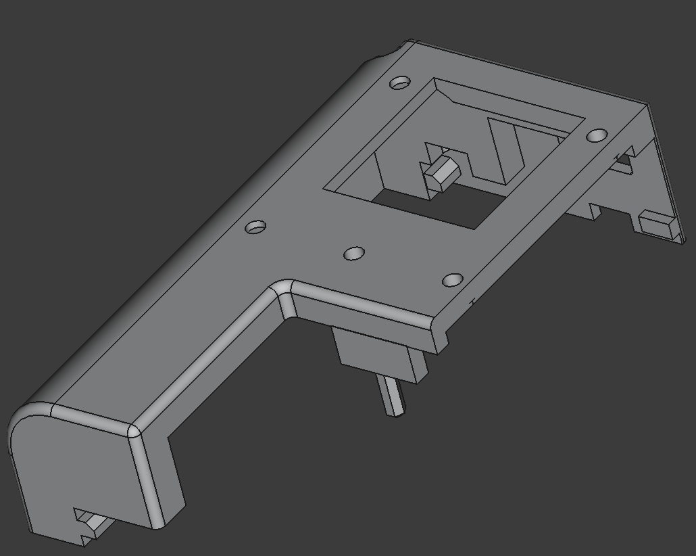 

以下はモジュール搭載用電池カバーに汎用的に搭載可能なモジュールケースです。(素人設計のため攻撃的なデザインになっています。必要に応じて編集もしくは参考にしてください。)
- 25mmトラックボール: [FreeCAD](3d-models/module_case/FreeCAD/trackball_25mm.FCStd), [STL](3d-models/module_case/STL/trackball_25mm-Body.stl)
- 30mmトラックパッド: [FreeCAD](3d-models/module_case/FreeCAD/trackpad_30mm.FCStd), [STL](3d-models/module_case/STL/trackpad_30mm-Body.stl)

    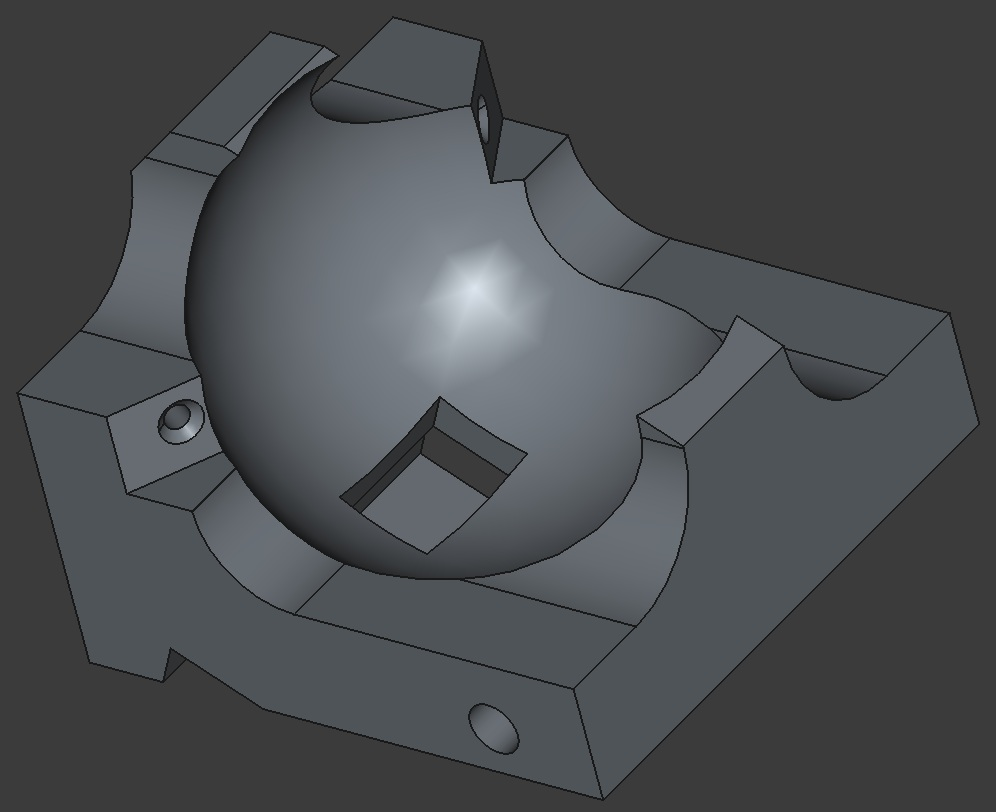 
    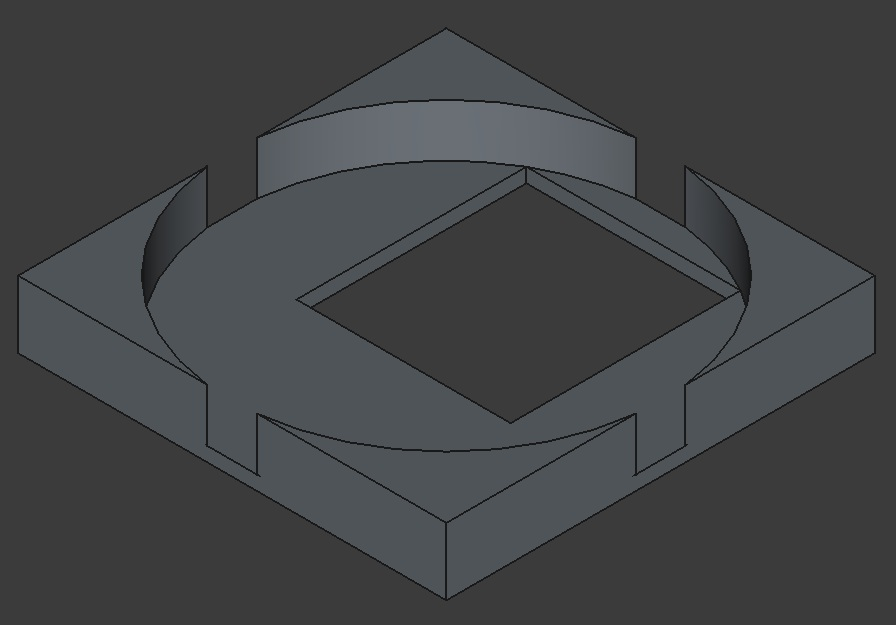 

### モジュールケース仕様 (torabo-tsuki-lpと共通)
- モジュールケース固定用ねじ径: M2
- ベアリング: 外径4mm, 内径1.5mm, 厚さ2mm
- ベアリング固定用ねじ径: M1.4

## 作例
### Sample1: torabo-tsuki-lp M に接続し、右手側にトラックボールを2個配置した例

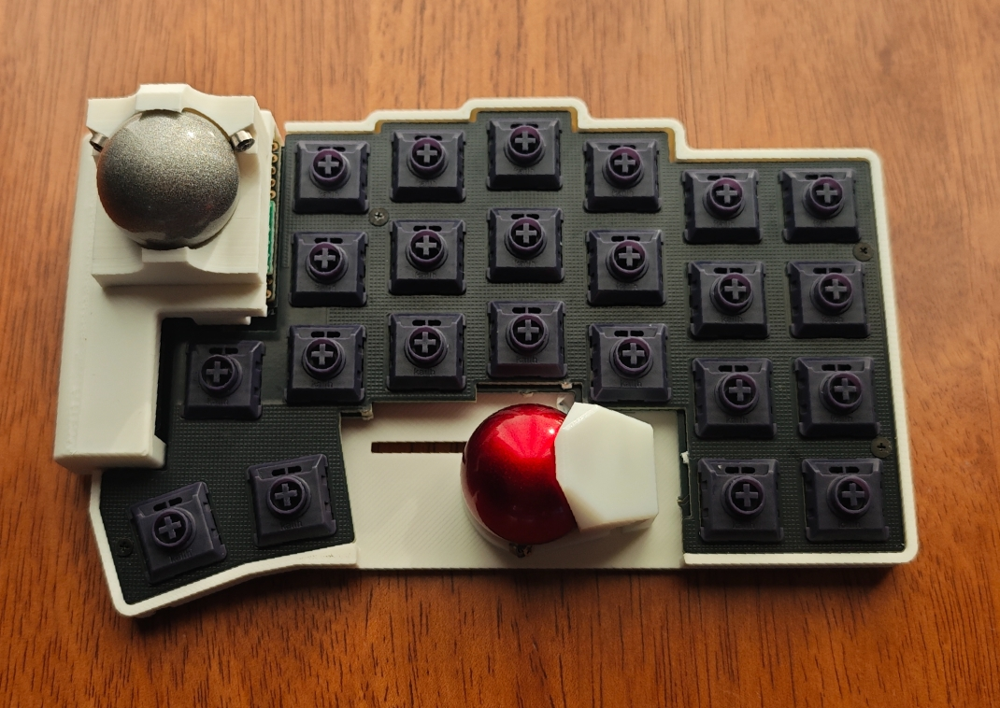 

### Sample2: [torabo-tsuki-OM M Cuttable](https://github.com/ngsyst/torabo-tsuki-om-cuttable/tree/master)に接続し、左手側にトラックボールとトラックパッドを配置した例

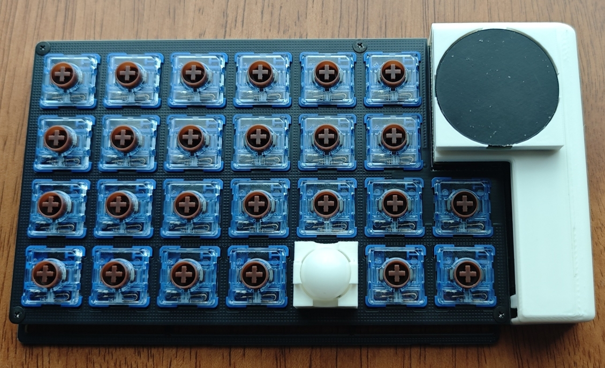 

## 免責事項
- 本リポジトリが提供するデータを使用したことにより発生したいかなる損害についても、作者は一切の責任を負いません。自己責任でご利用ください。
- 本リポジトリに関してせきごん氏への問い合わせはお控えください。

## ライセンス
このModのデータは、せきごん氏のオリジナルデータのライセンスに準拠し、非公式で編集・公開させていただいています。